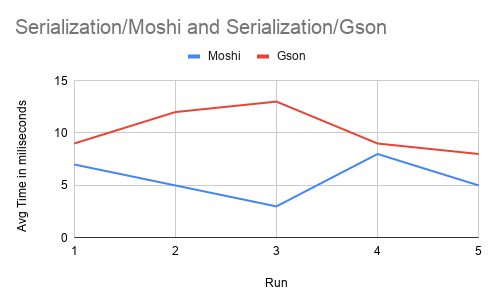
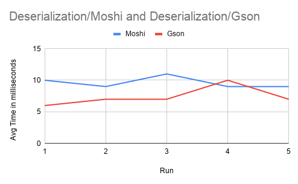

This project compares [Moshi](https://github.com/square/moshi) and [Gson](https://github.com/google/gson) in terms of performance. `mock_data.json`
is a file that contains a JSON array of 1000 objects.

Each test calculates the average of 10 iterations for serialization and deserialization with `Moshi` and `Gson` each. I plotted graphs for five runs of all  
four tests and here are results.

###  Serialization

### Deserialization
